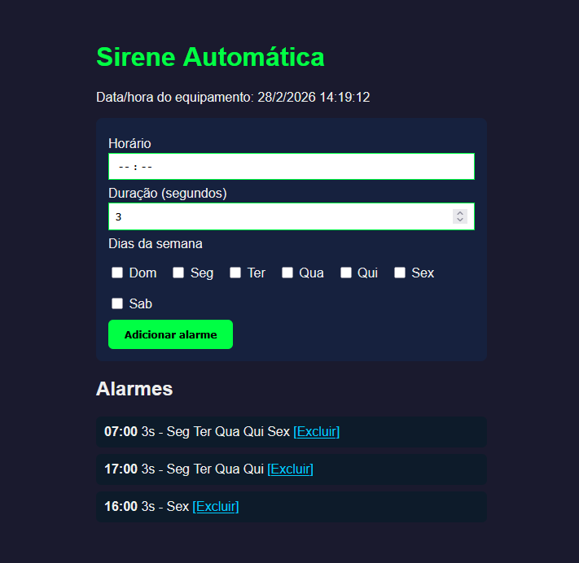

# Sirene Automática

Sistema de sirene automática para **NodeMCU ESP8266**, com horários programados via NTP, configuração por interface web e exibição em display I2C.

## Funcionalidades

- **Sirene em horários programados** — soa nos horários configurados, pelo tempo definido em segundos
- **Alarmes por dias da semana** — escolha horário, duração e em quais dias (Dom a Sab) o alerta deve tocar
- **Hora via NTP** — sincronização automática com a internet (timezone Brasil, -3)
- **Interface web** — configure os alarmes pelo navegador (Wi‑Fi)
- **Display I2C** — mostra data/hora atual e horário do próximo alarme
- **Acionamento por pino** — um pino vai a HIGH para ligar a sirene (ex.: relé ou módulo)

## Interface web

Acesse o IP exibido no display (ex.: `http://192.168.1.x/`) para:

- Ver a data e hora do equipamento
- Definir **horário** e **duração em segundos** do alarme
- Marcar os **dias da semana** em que o alarme deve tocar
- Listar e **excluir** alarmes já configurados



## Hardware

| Item        | Especificação                          |
|------------|----------------------------------------|
| Placa      | NodeMCU ESP8266 (ESP-12E)              |
| Display    | LCD I2C 17×2, endereço `0x3F`          |
| Sirene     | Pino **D5 (GPIO14)** — HIGH aciona     |

- **Display**: SDA e SCL no I2C do NodeMCU (geralmente D2/D1).
- **Sirene**: Conectar através de relé ou módulo de relé; o pino fornece nível lógico.

## Bibliotecas (Arduino IDE)

Em **Sketch → Incluir Biblioteca → Gerenciar Bibliotecas**, instale:

- **WiFiManager** (tzapu)
- **NTPClient** (Fabrice Weinberg)
- **Time** (TimeLib, Michael Margolis)
- **LiquidCrystal I2C** (Frank de Brabander ou compatível)

## Uso

1. Abra o sketch `Sirene.ino` no Arduino IDE e selecione a placa **NodeMCU 1.0 (ESP-12E Module)**.
2. Grave o firmware no NodeMCU.
3. Na primeira ligação, o ESP cria o Wi‑Fi **SireneAP** (senha: `sirene123`). Conecte um celular ou PC a esse rede.
4. Abra o navegador; deve abrir a página de configuração do WiFiManager. Informe a rede e a senha da sua rede Wi‑Fi e salve.
5. Depois que o ESP conectar, anote o **IP** que aparecer no display e acesse no navegador (ex.: `http://192.168.1.100`).
6. Cadastre os alarmes (horário, duração, dias). No horário programado, a sirene será acionada pelo tempo definido.

## Estrutura do projeto

```
Sirene/
├── Sirene.ino   # Sketch principal
├── README.md
└── web.png      # Captura da interface web
```

## Licença

Uso livre para projetos pessoais e educacionais.
